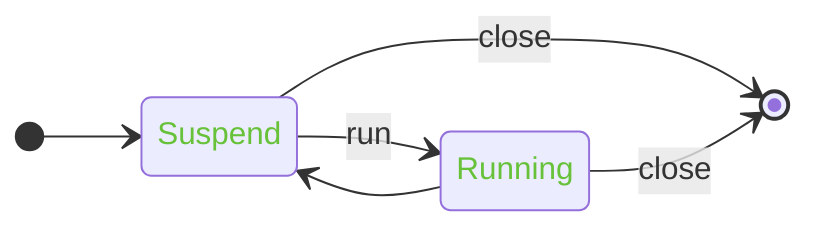
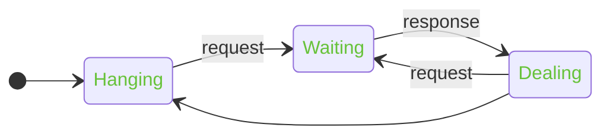
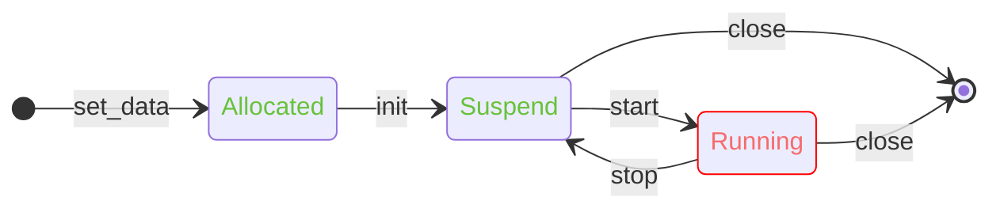

# Lifecycle Design

There are mainly many types of resources involved in the project that need to be managed, including `loop`, `request`,
and `handle`.

Besides the objects related to `libuv`, the relevant resources also contain objects for C++ features, and the relevant
data is stored in the member `data`.

## Loop

Following is the life states of `loop`.

- **Suspend[*attached*]**: Context data allocated. `uv_loop_init` applied.
- **Running[*attached*]**: Loop running.

- **run**: Run the `loop`.
- **close**: Close the `loop`.

The context data will be allocated and released with `uv_loop_t`.

**Note**: object cannot be used after `close`.

## Request

Following is the life states of `request`.

- **Hanging[*attached*]**: Request object initialized.
- **Waiting[*attached*]**: Context data allocated. Request method applied, waiting callback in `loop` event.
- **Dealing[*attached*]**: Previous context data is about to be released. The request callback is being processed.

- **request**: New context data. Call request method, such as `fs::open`, `random` and `tcp::connect`.
- **response**: Release previous context data. `resolve` the request's `promise`.

Resources will be properly recycled in all states.  
However, it should be noted that `request` operations can only be performed in the `Hanging` and `Dealing` states.

## Handle

> In the new version, the strategy for the lifecycle has been modified, and it no longer automatically "detaches".
> An explicit "detach" interface is provided, allowing the status to be explicitly adjusted to "detach" when needed.

Following is the life states of `handle`.

- **Allocated[*attached*]**: Context data allocated but libuv's `handle` no initialized yet.
- **Suspend[*attached*]**: Handle initialized but not running.
- **Running[*detached*]**: Handle is running.

- **set_data**: New context data and set `handle->data`.
- **init**: Initialize `handle` with `uv_<handle>_init`.
- **start**: Start callback operations, such as `start` for `timer`, `listen` for `tcp`, and `read_start` for `stream`.
- **stop**: Stop callback operations, but not close handle. such as `stop` for `timer`.
- **close**: Close `handle`. Release context data and reset `handle->data`.

If the `handle` is in the `attached` state, resources will be automatically recycled when the `handle` is no longer
referenced.

If the `handle` is in the `detached` state, resources will not be automatically recycled. Users need to explicitly
call `close` or throw `uvcxx::close_handle` in the `handle` callback.

**Note**: object cannot be used after `close`.
